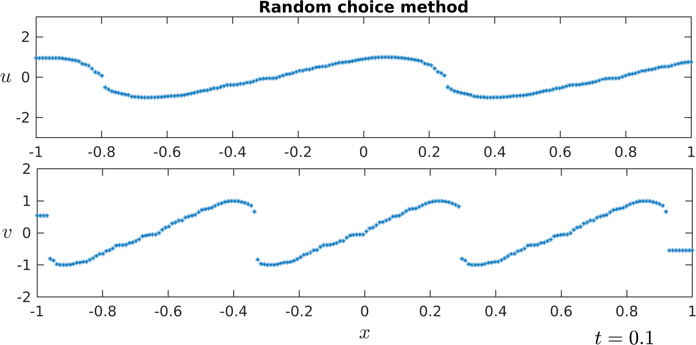

# Background viscosity dependent Riemann solver for the MHD-Burgers model


## Description:
A family of exact Riemann solvers for the MHD-Burgers model that incorporates the crossing of characteristic speeds and non-classical shock waves.
It serves as a builing block for numerical schemes like the Godunov method, the random choice method (Glimm's scheme) or numerical front tracking.

The MHD-Burgers model
```math
\begin{pmatrix} u\\v\end{pmatrix}_t + \begin{pmatrix} \frac{1}{2}u^2\\\frac{1}{2}cv^2\end{pmatrix}_x = \begin{pmatrix} 0\\0\end{pmatrix},\quad c>0 \tag{1}
```
is non-strictly hyperbolic. The corresponding system with viscosity reads

```math
\begin{pmatrix} u\\v\end{pmatrix}_t + \begin{pmatrix} \frac{1}{2}u^2\\\frac{1}{2}cv^2\end{pmatrix}_x = B\begin{pmatrix} u\\v\end{pmatrix}_{xx},\tag{2}
```
where $B\in\mathbb{R}^{2\times 2}$ is any symmetric and positive definite matrix.

The function `RiemannSolverMHD.m` evaluates the unique(!) solution to the Riemann problem
```math
u(x,0)=\begin{cases}(u_l,v_l),&x<0\\(u_r,v_r),&x>0\end{cases},\qquad ((u_l,v_l),(u_r,v_r))\in(\mathbb{R}^2)^2

```
for (1) such that each shock wave has a visous profile with respect to (2). The solution is sensitively dependent on the viscosity matrix $B$ and consists of 
Lax-shocks, rarefaction waves, and non-classical (undercompressive) shock waves. 


## Syntax
```
[S1,S2] = RiemannSolverMHDBurgers(uL,vL,uR,vR,B,c,evalPts);
```

Input:
        uL - (array) left values in the u-variable
        uR - (array) right values in the u-variable
        vL - (array) left values in the v-variable
        vR - (array) right values in the v-variable
        B - (2x2 array) symmetric positive definite viscosity matrix
        evalPts - (array) evaluation points

Output 
        S1 - (array) of the u components of the solution(s) evaluated at evalPts and t=1
        S2 - (array) of the v components of the solution(s) evaluated at evalPts and t=1

Possibilities;
        1. uL,uR,vL,vR are numbers and evalPts is a matrix:
          The output contains the values of the solution of the single Riemann
          problem with data ((uL,uR),(vL,vR)).
        2. uL,uR,vL,vR,evalPts are matrices of the same size:
          The (i,j)-th entry of the output contains the value of the
          solution to the Riemann problem with data ((uL(i,j),uR(i,j)),(vL(i,j),vR(i,j)))
          evaluated at evalPts(i,j)
        3. uL,uR,vL,vR are matrices of the same size and evalPts is a number:
          The (i,j)-th entry of the output contains the value of the
          solution to the Riemann problem with data ((uL(i,j),uR(i,j)),(vL(i,j),vR(i,j)))
          evaluated at evalPts


## Examples

#### Minimal example
The following code solves and displays the Riemann problem.  
```
% specify model
B = [1,0.9;0.9,1];
c=1;
% initial data
uL = 1.2;
vL = 0.2;
uR = -0.8;
vR = 1.7;
% The solution will be evaluated at evalPts
evalPts = -0.8:0.01:2.2;

[S1,S2] = RiemannSolverMHDBurgers(uL,vL,uR,vR,B,c,evalPts);

plot(evalPts,S1,'r-','LineWidth',3);hold on;
plot(evalPts,S2,'k-','LineWidth',3);
```
This produces the following plot.


#### Godunov method

An example for the solver used in the Godunov method can be found in `ex1_godunov.m`.
The sequence of Riemann problems at each timestep can be solved simultaneously.


#### Random-choice method

An example for the solver used in the random-choice method (Glimm's scheme) can be found in `ex2_glimm.m`.




## Author
+ [Valentin Pellhammer](http://www.math.uni-konstanz.de/~pellhammer/)  
 Department of Mathematics and Statistics,  
 University of Konstanz,  
 78457 Konstanz, Germany
